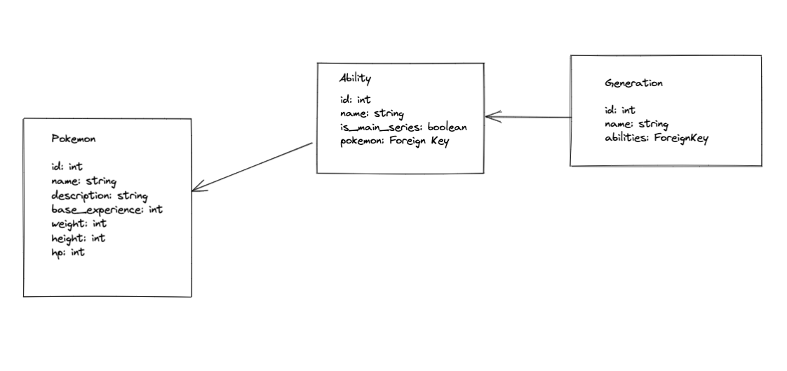

# Pokemon Crawler

Django app that crawls the PokeApi and persists pokemon data: https://pokeapi.co/
Project started from https://github.com/cybsafe/pokemon-crawler

### Requirements:

* Python 3
* Docker: https://docs.docker.com/compose/install/
* PostrgreSQL: https://www.postgresql.org/download/ (or use brew)

### To run:
 
Clone the repo then from the pokemon-crawler folder run:
* `docker-compose up`
* `docker-compose exec web python -m pip install -r requirements.txt`

If there are any migrations needed:
* `docker-compose exec web python manage.py migrate`

Then browse to: http://localhost:8000/pokemon-home/
Click `Start crawler` to trigger the crawl, and pokemon data will start to be populated in the database.
The crawling will take a while. The status can be checked from the logger output in the console.
For a shorter crawl the code can be changed to only go through the first few pages in `crawler.py`.

To see the data go to: http://localhost:8000/admin/
There will be 3 tables created under APP: Abilitys, Generations, Pokemons

You will have to create a superuser to be able to log into the Django admin:
* `docker-compose exec web python manage.py createsuperuser`

### Future improvements:
* The crawl functionality could be moved to a command, then that command could be called by a task from a queue
--> In this case the UI won't have to wait for the crawl to finish
* Add a method/button to stop the crawl
* Create a PokemonManager - a helper that links the pokemon to the stats, abilities and generations
* Save the last visited url/pokemon ID so if we restart the task it continues
* Persist more stats and abilities
* Use the Django template to add a button that triggers the crawler 
* Display the data via the Django template 
* Add tests for the views, models and crawler
-- for views call the get request and build the url using reverse()
-- for models check the right data gets saved with no duplicates
-- for the crawler mock the Poke API response

* Use the pokemon data to create contests between them in a responsive Django web app

